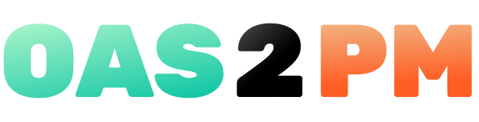

<div align="center">
    
    <div>
      <strong align="center">OAS 2 Postman</strong>
    </div>
    <div align="center">
      Convert OpenAPI specification files to Postman Collections
    </div>
    </br>
    <a href="https://alpha.dev.magalu.com">
    
    </a>
</div>
</br>

---

</br>


<details open="open">
  <summary><strong style="display: inline-block">Table of Contents</strong></summary>
  
  1. [Overview](#overview)
  1. [Development](#development)
  
</details>
</br>

## Using

You can simply prepend `oas2pm.abaca.team?url=` to any OpenAPI specification url!

## Development

- Clone the repository and install the dependencies
    ```sh
    yarn
    # or
    npm i
    ```
- Run the Netlify development server
  ```sh
  yarn dev
  ```
- Access the endpoint
    - By default it's located at http://localhost:8888/.netlify/functions/convert